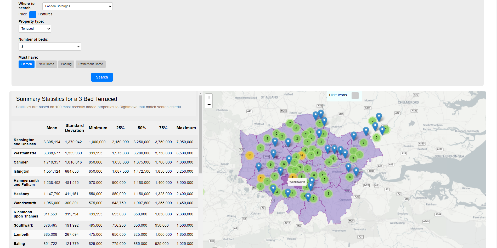
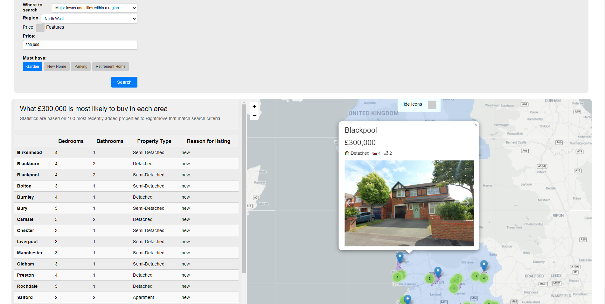
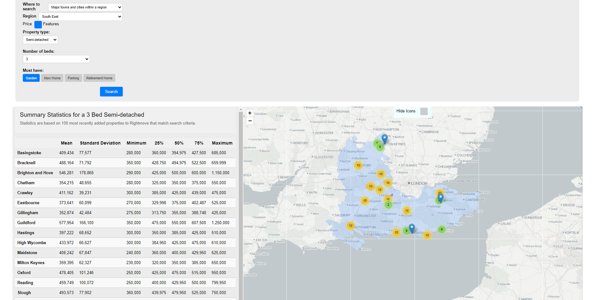

# Property Explorer
An insight into housing costs across England

## Project Overview

This project aims to highlight the variation in house prices across England, within a region, or within London.

Users are able to search by price to get an idea of what type of property can be purchased across an area.

Users can also search by property specifications and observe the variation in price across an area. For example, a user could search for a three bed semi-detached house in the South East of England

## Features

- A table displaying most common attributes of an area's subdivisions
- An interactive map displaying a selection of properties
    - Each property has a popup window containing a summary and an image carousel

## Examples

### London Boroughs
A search comparing the price of a three bed tarraced across the London Boroughs.

### Regional Price Search
A search to determine what can be bought with £300,000 within the North West of England

### Regional Feature Search
A search to see how much a 3 bed semi-detached costs across the South East.

